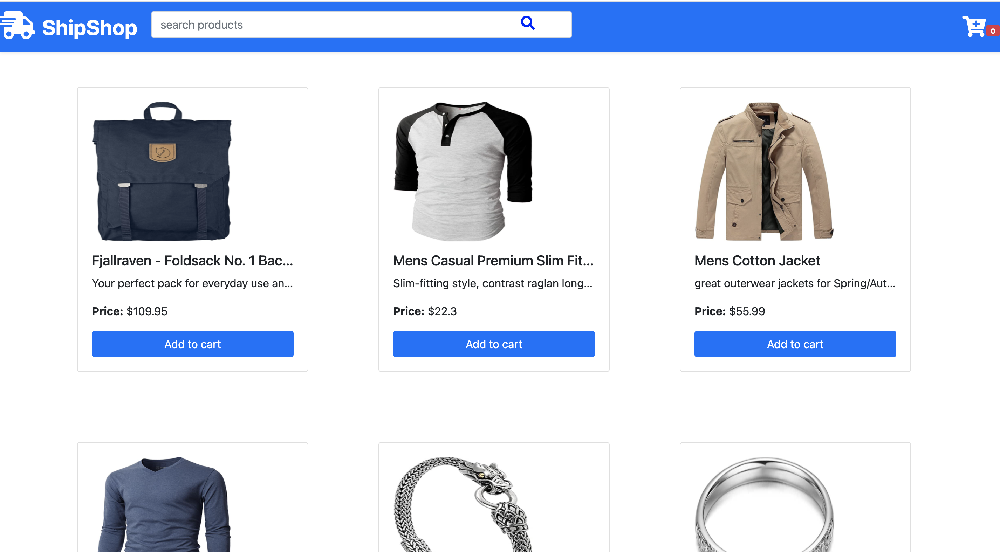
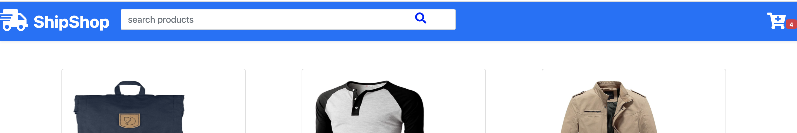
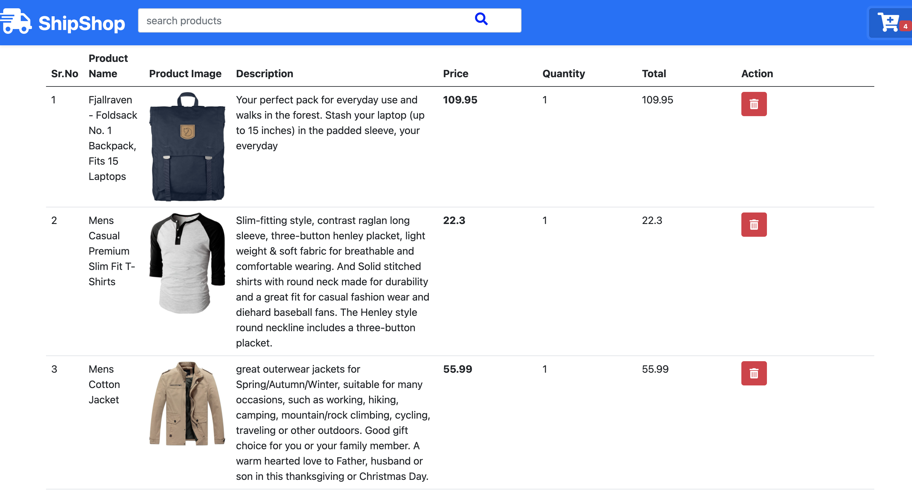
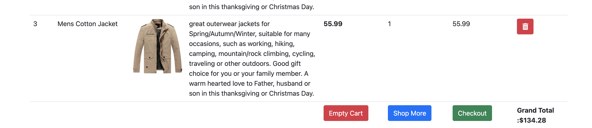
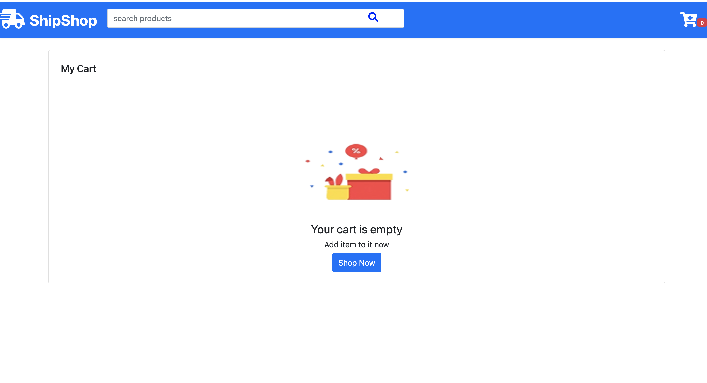

# Commerce

This project was generated with [Angular CLI](https://github.com/angular/angular-cli) version 12.2.8.

## Development server

Run `ng serve` for a dev server. Navigate to `http://localhost:4200/`. The app will automatically reload if you change any of the source files.

## Home page 

## Cart contains the number of products

 
## Cart page contains the products we have added

## the some button to remove the product, remove all products and redirect to the home page with the total price of products

 
 ## page with Cart empty
  

